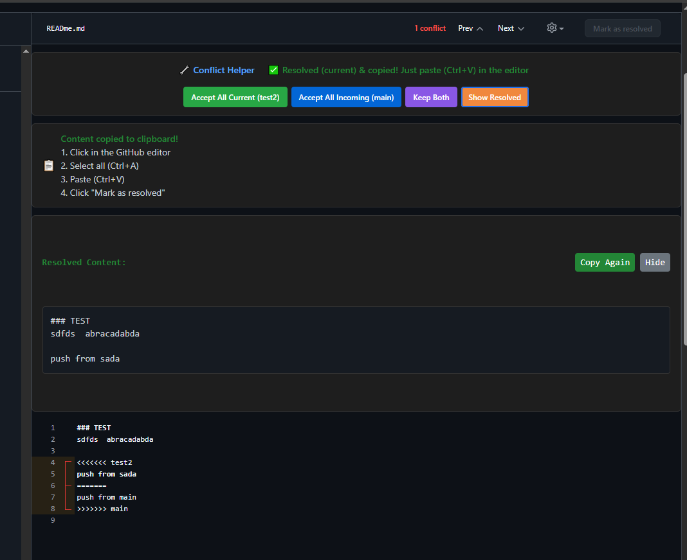

# GitHub Merge Conflict Helper

A Chrome browser extension that simplifies resolving merge conflicts on GitHub with one-click buttons and automatic clipboard copying.

<div align="center">
  
  
  *One-click merge conflict resolution for GitHub*
</div>



## Features

- 🚀 **One-click conflict resolution** - Accept current, incoming, or both changes instantly
- 📋 **Automatic clipboard copying** - Resolved content is automatically copied, just paste!
- 🏷️ **Branch name display** - Shows which branch is "current" and which is "incoming"
- 🔒 **Safe operation** - Works with GitHub's existing editor without breaking functionality
- 🎯 **Smart detection** - Automatically detects conflict markers and branch information
- 💡 **Copy-paste workflow** - Simple and reliable approach that always works

## How It Works

1. **Navigate to a GitHub merge conflict page**
2. **Click one of the resolution buttons:**
   - `Accept All Current` - Keep changes from your current branch
   - `Accept All Incoming` - Accept changes from the incoming branch  
   - `Keep Both` - Preserve both sets of changes
3. **Content is automatically copied to clipboard**
4. **Paste (Ctrl+V) into GitHub's editor**
5. **Click GitHub's "Mark as resolved" button**

## Installation

### Method 1: Download Release (Recommended)

1. **Download the latest release** from the [Releases page](https://github.com/anasyd/GithubAssist/releases)
2. **Extract the ZIP file** to a folder on your computer
3. **Skip to "Load Extension" section below**

### Method 2: Clone Repository

```bash
git clone https://github.com/anasyd/GithubAssist.git
cd GithubAssist
```

### Load Extension in Chrome

1. **Open Chrome** and navigate to `chrome://extensions/`
2. **Enable "Developer mode"** (toggle in top-right corner)
3. **Click "Load unpacked"**
4. **Select the folder** containing the extension files
5. **The extension will appear** in your extensions list

### Verify Installation

- Look for the extension icon in your Chrome toolbar
- Visit a GitHub repository with merge conflicts to test
- The helper buttons should appear on conflict resolution pages

## Usage

### Basic Workflow

1. **Open a pull request** with merge conflicts on GitHub
2. **Click "Resolve conflicts"** to enter GitHub's conflict editor
3. **Extension buttons appear** above the editor showing branch names
4. **Choose your resolution strategy:**
   - **Accept All Current** (`your-branch-name`) - Keep your changes
   - **Accept All Incoming** (`main`) - Accept incoming changes
   - **Keep Both** - Preserve both versions
5. **Content is auto-copied** - just paste with `Ctrl+V`
6. **Complete the resolution** by clicking GitHub's "Mark as resolved"

### Button Guide

| Button | Action | When to Use |
|--------|--------|-------------|
| `Accept All Current` | Keep your branch's changes | Your code is correct/preferred |
| `Accept All Incoming` | Accept the other branch's changes | Their code is better/newer |
| `Keep Both` | Preserve both sets of changes | Both changes are needed |
| `Show Resolved` | Display the resolved content | Review before pasting |

### Visual Indicators

- **Green button**: Accept current branch changes
- **Blue button**: Accept incoming branch changes  
- **Purple button**: Keep both sets of changes
- **Yellow button**: Show resolved content for review
- **Branch names** appear below buttons for clarity

## Troubleshooting

### Extension Not Appearing

- **Check you're on a conflict page**: Extension only activates on GitHub conflict resolution pages
- **Refresh the page**: Try reloading the GitHub page
- **Check extension is enabled**: Visit `chrome://extensions/` and ensure it's enabled
- **Look for errors**: Open Developer Tools (F12) and check for error messages

### Copy/Paste Issues

- **Manual copy option**: Use the "Show Resolved" button if auto-copy fails
- **Browser permissions**: Some browsers may block clipboard access
- **Alternative method**: Select and copy the resolved content manually

### Content Not Updating

- **Use copy-paste workflow**: The extension doesn't directly modify GitHub's editor
- **Follow the steps**: Copy resolved content → Select all in editor → Paste
- **GitHub's "Mark as resolved"**: Always click this after pasting

### Branch Names Not Showing

- **Generic names displayed**: Shows "current" and "incoming" if detection fails
- **Still functional**: Extension works even without specific branch names
- **Check conflict markers**: Branch names are extracted from `<<<<<<< branch-name`

## Browser Compatibility

- ✅ **Chrome** (Recommended)
- ✅ **Microsoft Edge** (Chromium-based)
- ✅ **Brave Browser**
- ✅ **Other Chromium browsers**
- ❌ **Firefox** (Not compatible - uses different extension format)
- ❌ **Safari** (Not compatible)

## Privacy & Security

- 🔒 **No data collection** - Extension operates entirely locally
- 🚫 **No external requests** - Only reads from GitHub pages you visit
- 🏠 **Local processing** - All conflict resolution happens in your browser
- 🔐 **No permissions abuse** - Only requests necessary `activeTab` access
- 📝 **Open source** - All code is available for review

## Technical Details

### File Structure
```
GithubAssist/
├── icons
│   ├── icon.png
│   ├── icon.svg
│   ├── icon128.png
│   ├── icon16.png
│   └── icon48.png
├── images
│   ├── icon.png
│   └── Screenshot.png
├── content.js
├── LICENSE
├── manifest.json
├── popup.html
├── popup.js
├── README.md
└── styles.css
```

### Permissions Explained

- **`activeTab`**: Required to read conflict content from GitHub pages
- **`storage`**: Used for extension settings (currently minimal usage)

### GitHub Integration

- **Read-only approach**: Extension only reads conflict content, never writes
- **Safe operation**: Doesn't interfere with GitHub's CodeMirror editor
- **Copy-paste workflow**: Reliable method that works with GitHub's security policies

## Contributing

Found a bug or want to contribute? 

1. **Fork the repository**
2. **Create a feature branch**: `git checkout -b feature-name`
3. **Make your changes** and test thoroughly
4. **Submit a pull request** with a clear description

### Development Setup

1. **Clone the repository**
```bash
git clone https://github.com/anasyd/GithubAssist.git
cd GithubAssist
```
2. **Make changes** to the source files
3. **Test locally** by loading the unpacked extension
4. **Verify functionality** on actual GitHub conflict pages

## License

This project is open source and available under the [MIT License](LICENSE).

## Support

- 🐛 **Report bugs**: [Open an issue](https://github.com/anasyd/GithubAssist/issues)
- 💡 **Feature requests**: [Start a discussion](https://github.com/anasyd/GithubAssist/discussions)
- 📧 **Contact**: Create an issue for support questions

## Changelog

### v1.0.0
- Initial release
- One-click conflict resolution
- Automatic clipboard copying
- Branch name detection
- Safe copy-paste workflow

---

**Made with ❤️ for developers who hate tedious merge conflicts**

> **Note**: This extension is not affiliated with GitHub. It's a community tool to improve the conflict resolution experience.